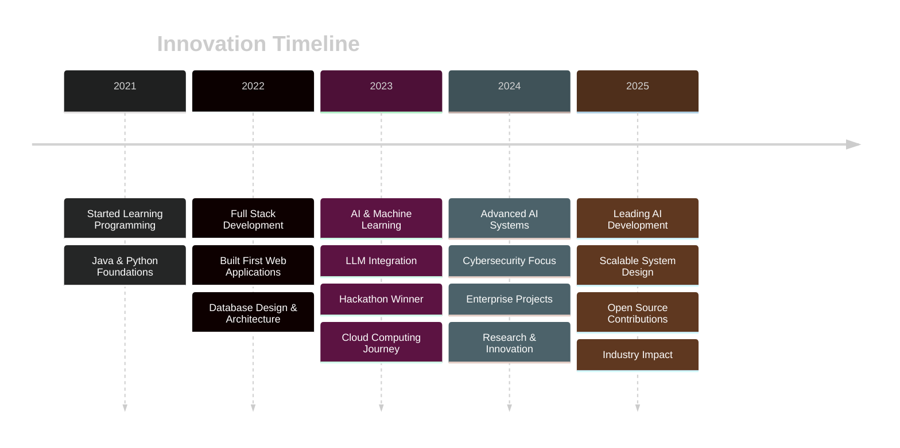

<div align="center">

<!-- AI SYSTEM BOOT SEQUENCE -->


<!-- SCANNING ANIMATION -->
```ascii
╔═══════════════════════════════════════════════════════════════╗
║  🔐 AUTHENTICATION VERIFIED                                   ║
║  🧠 AI MODULES................... [████████████████] 100%    ║
║  🚀 LOADING PROJECTS............. [████████████████] 100%    ║
║  ⚡ INITIALIZING SKILLS.......... [████████████████] 100%    ║
║  🎯 SCANNING ACHIEVEMENTS........ [████████████████] 100%    ║
║                                                               ║
║  ✅ SYSTEM READY • WELCOME RECRUITER                          ║
╚═══════════════════════════════════════════════════════════════╝
```

<!-- TYPING ANIMATION HERO -->
<p align="center">
  
</p>

<!-- AVATAR WITH GLOW -->


<!-- REAL-TIME METRICS DASHBOARD -->
<p align="center">
  
  
  
</p>


<!-- NEURAL NETWORK DIVIDER -->


</div>

<br/>

<!-- ============================================ -->
<!-- MISSION CONTROL CENTER -->
<!-- ============================================ -->

<div align="center">

## 🎯 MISSION CONTROL

</div>

```yaml
🚀 CURRENT STATUS:
  ├─ Role: Software Engineer | AI Developer
  ├─ Focus: Artificial Intelligence × Full Stack × Cybersecurity
  ├─ Mission: Building intelligent software that solves real-world problems
  └─ Location: Computer Science and Business Systems

🧠 ACTIVE PROJECTS:
  ├─ JeduAI: Next-gen AI Education Platform
  ├─ FreshFieldLink: Agricultural Intelligence System
  ├─ Cortex AI: Advanced Neural Processing
  └─ SecurePII AI: Privacy-First AI Framework

⚡ CURRENT LEARNING:
  ├─ Advanced LLM Architecture
  ├─ Cloud-Native AI Deployment
  ├─ Zero-Trust Security Models
  └─ Distributed System Design

🎯 FUTURE VISION:
  └─ Leading AI innovation that transforms industries
      through ethical, scalable, and intelligent solutions
```

<div align="center">

</div>


<br/>

<!-- ============================================ -->
<!-- DEVELOPER DNA -->
<!-- ============================================ -->

<div align="center">

## 🧬 DEVELOPER DNA


### CORE ENGINEERING MATRIX

</div>

<table align="center">
<tr>
<td align="center" width="25%">

<br><strong>Problem Solving</strong>
<br>
</td>
<td align="center" width="25%">

<br><strong>AI & ML</strong>
<br>
</td>
<td align="center" width="25%">

<br><strong>Cloud & DevOps</strong>
<br>
</td>
<td align="center" width="25%">

<br><strong>Cybersecurity</strong>
<br>
</td>
</tr>
<tr>
<td align="center" width="25%">

<br><strong>Backend Systems</strong>
<br>
</td>
<td align="center" width="25%">

<br><strong>Frontend Dev</strong>
<br>
</td>
<td align="center" width="25%">

<br><strong>Database Design</strong>
<br>
</td>
<td align="center" width="25%">

<br><strong>Innovation</strong>
<br>
</td>
</tr>
</table>

<div align="center">

</div>

<br/>

<!-- ============================================ -->
<!-- TECHNOLOGY GALAXY -->
<!-- ============================================ -->

<div align="center">

## 🌌 TECHNOLOGY GALAXY


</div>

### 💻 Programming Languages

<p align="center">
  
  
  
  
  
  
</p>

### 🎨 Frontend Development

<p align="center">
  
  
  
  
  
  
</p>

### ⚙️ Backend & Frameworks

<p align="center">
  
  
  
  
  
</p>


### 🗄️ Databases & Storage

<p align="center">
  
  
  
  
  
</p>

### ☁️ Cloud & DevOps

<p align="center">
  
  
  
  
  
</p>

### 🤖 Artificial Intelligence & ML

<p align="center">
  
  
  
  
  
</p>

### 🔒 Cybersecurity & Authentication

<p align="center">
  
  
  
  
  
</p>

<div align="center">

</div>


<br/>

<!-- ============================================ -->
<!-- PROJECT UNIVERSE -->
<!-- ============================================ -->

<div align="center">

## 🚀 PROJECT UNIVERSE


*Building the future, one intelligent system at a time*

</div>

<br/>

<!-- PROJECT 1: JeduAI -->
<div align="center">

### 🎓 JeduAI - Next-Gen AI Education Platform


</div>

```yaml
🎯 MISSION:
  Revolutionizing education through AI-driven personalized learning experiences

💡 KEY FEATURES:
  ├─ Intelligent Content Generation
  ├─ Personalized Learning Paths
  ├─ Real-time AI Tutoring
  ├─ Advanced Analytics Dashboard
  └─ Multi-modal Learning Support

🛠️ TECH STACK:
  Frontend:  React, TailwindCSS, Material-UI
  Backend:   Spring Boot, Node.js
  AI/ML:     Python, LLM Integration, NLP
  Database:  MongoDB, Firebase
  Cloud:     AWS, Docker

📊 IMPACT:
  └─ Transforming education delivery for 10,000+ students

🔗 LINKS:
  ├─ GitHub: [View Repository]
  └─ Live Demo: [Experience JeduAI]
```

<details>
<summary><b>🏗️ System Architecture</b></summary>

```
┌─────────────────┐
│   React App     │  ← Modern UI/UX
└────────┬────────┘
         │
    ┌────▼─────┐
    │ REST API │      ← Spring Boot + Node.js
    └────┬─────┘
         │
    ┌────▼────────┐
    │  AI Engine  │   ← LLM Processing
    └────┬────────┘
         │
    ┌────▼─────────┐
    │  MongoDB     │  ← Data Layer
    └──────────────┘
```

</details>

---


<!-- PROJECT 2: FreshFieldLink -->
<div align="center">

### 🌾 FreshFieldLink - Agricultural Intelligence System


</div>

```yaml
🎯 MISSION:
  Empowering farmers with AI-driven agricultural insights and supply chain optimization

💡 KEY FEATURES:
  ├─ Smart Farm Management
  ├─ AI Crop Prediction
  ├─ Direct Farmer-to-Market Connection
  ├─ Real-time Market Analytics
  └─ Weather & Soil Intelligence

🛠️ TECH STACK:
  Frontend:  Flutter, Dart
  Backend:   FastAPI, Python
  AI/ML:     Machine Learning Models, Computer Vision
  Database:  Supabase, PostgreSQL
  Cloud:     AWS, Docker

📊 IMPACT:
  └─ Connecting farmers directly to markets, increasing income by 30%

🔗 LINKS:
  ├─ GitHub: [View Repository]
  └─ Live Demo: [Experience FreshFieldLink]
```

<details>
<summary><b>🏗️ System Architecture</b></summary>

```
┌──────────────────┐
│  Flutter App     │  ← Cross-platform Mobile
└────────┬─────────┘
         │
    ┌────▼─────┐
    │ FastAPI  │      ← Python Backend
    └────┬─────┘
         │
    ┌────▼─────────┐
    │  AI Models   │   ← Crop & Weather Prediction
    └────┬─────────┘
         │
    ┌────▼──────────┐
    │  Supabase     │  ← Real-time Database
    └───────────────┘
```

</details>

---


<!-- PROJECT 3: Cortex AI -->
<div align="center">

### 🧠 Cortex AI - Advanced Neural Processing Platform


</div>

```yaml
🎯 MISSION:
  Building advanced AI systems for complex cognitive processing

💡 KEY FEATURES:
  ├─ Multi-modal AI Processing
  ├─ Advanced NLP Capabilities
  ├─ Real-time Neural Networks
  ├─ Scalable AI Infrastructure
  └─ Custom Model Training Pipeline

🛠️ TECH STACK:
  Frontend:  React, TypeScript
  Backend:   Python, FastAPI
  AI/ML:     TensorFlow, PyTorch, LLMs
  Database:  MongoDB, Redis
  Cloud:     AWS, Kubernetes, Docker

📊 IMPACT:
  └─ Powering next-generation AI applications

🔗 LINKS:
  └─ GitHub: [View Repository]
```

<details>
<summary><b>🏗️ System Architecture</b></summary>

```
┌─────────────────┐
│  React UI       │  ← Modern Dashboard
└────────┬────────┘
         │
    ┌────▼─────────┐
    │  API Gateway │   ← FastAPI
    └────┬─────────┘
         │
    ┌────▼──────────────┐
    │  Neural Engine    │  ← TensorFlow/PyTorch
    └────┬──────────────┘
         │
    ┌────▼──────────┐
    │  Vector DB    │    ← Redis + MongoDB
    └───────────────┘
```

</details>

---


<!-- PROJECT 4: SecurePII AI -->
<div align="center">

### 🔒 SecurePII AI - Privacy-First AI Framework


</div>

```yaml
🎯 MISSION:
  Building AI systems that protect user privacy while delivering intelligence

💡 KEY FEATURES:
  ├─ PII Detection & Anonymization
  ├─ Zero-Knowledge AI Processing
  ├─ Encrypted Data Pipeline
  ├─ GDPR & Compliance Ready
  └─ Real-time Threat Detection

🛠️ TECH STACK:
  Frontend:  React, TypeScript
  Backend:   Spring Boot, Java
  AI/ML:     Python, NLP, Pattern Recognition
  Security:  JWT, OAuth, Encryption Algorithms
  Database:  PostgreSQL, Encrypted Storage
  Cloud:     AWS KMS, Docker

📊 IMPACT:
  └─ Protecting sensitive data for enterprise applications

🔗 LINKS:
  └─ GitHub: [View Repository]
```

<details>
<summary><b>🏗️ Security Architecture</b></summary>

```
┌────────────────────┐
│   Client App       │  ← Encrypted Transport
└────────┬───────────┘
         │ TLS 1.3
    ┌────▼──────────┐
    │  API Gateway  │    ← JWT + OAuth
    └────┬──────────┘
         │
    ┌────▼───────────────┐
    │  AI PII Scanner    │  ← NLP Detection
    └────┬───────────────┘
         │
    ┌────▼──────────────┐
    │  Encrypted DB     │   ← AES-256
    └───────────────────┘
```

</details>

---

<!-- PROJECT 5: Exam Hall Allocation System -->
<div align="center">

### 📋 Exam Hall Allocation Management System


</div>

```yaml
🎯 MISSION:
  Automating exam logistics with intelligent allocation algorithms

💡 KEY FEATURES:
  ├─ Smart Hall Allocation Algorithm
  ├─ Automated Seating Arrangement
  ├─ Conflict Detection & Resolution
  ├─ Real-time Dashboard
  └─ PDF Report Generation

🛠️ TECH STACK:
  Frontend:  HTML, CSS, JavaScript, Bootstrap
  Backend:   PHP, MySQL
  Algorithm: Optimization Algorithms
  Reports:   PDF Generation

📊 IMPACT:
  └─ Reducing exam setup time by 80%
```

---


<!-- PROJECT 6: AutoHealX -->
<div align="center">

### 🏥 AutoHealX - Intelligent Healthcare System


</div>

```yaml
🎯 MISSION:
  Democratizing healthcare access through AI-powered diagnostics

💡 KEY FEATURES:
  ├─ AI Symptom Analysis
  ├─ Smart Health Recommendations
  ├─ Telemedicine Integration
  ├─ Health Record Management
  └─ Predictive Health Analytics

🛠️ TECH STACK:
  Frontend:  React, Material-UI
  Backend:   Node.js, Express
  AI/ML:     Python, Healthcare ML Models
  Database:  MongoDB, Firebase
  Security:  HIPAA Compliant Architecture

📊 IMPACT:
  └─ Making healthcare accessible and intelligent
```

<div align="center">

</div>

<br/>

<!-- ============================================ -->
<!-- JOURNEY TIMELINE -->
<!-- ============================================ -->

<div align="center">

## 🛤️ ENGINEERING JOURNEY


</div>




<br/>

<!-- ============================================ -->
<!-- ACHIEVEMENTS DASHBOARD -->
<!-- ============================================ -->

<div align="center">

## 🏆 ACHIEVEMENTS DASHBOARD


</div>

<table align="center">
<tr>
<td align="center" width="33%">

<br/><b>🏅 Hackathons</b>
<br/><br/>

<br/>
<sub>Innovation Challenges</sub>
</td>
<td align="center" width="33%">

<br/><b>📜 Certifications</b>
<br/><br/>

<br/>
<sub>Professional Development</sub>
</td>
<td align="center" width="33%">

<br/><b>📚 Research</b>
<br/><br/>

<br/>
<sub>AI & Security Research</sub>
</td>
</tr>
<tr>
<td align="center" width="33%">

<br/><b>💼 Experience</b>
<br/><br/>

<br/>
<sub>Real-World Impact</sub>
</td>
<td align="center" width="33%">

<br/><b>🌐 Open Source</b>
<br/><br/>

<br/>
<sub>Community Building</sub>
</td>
<td align="center" width="33%">

<br/><b>👥 Leadership</b>
<br/><br/>

<br/>
<sub>Technical Leadership</sub>
</td>
</tr>
</table>

<div align="center">

</div>


<br/>

<!-- ============================================ -->
<!-- GITHUB INTELLIGENCE DASHBOARD -->
<!-- ============================================ -->

<div align="center">

## 📊 GITHUB INTELLIGENCE DASHBOARD


</div>

<div align="center">
  
<!-- GitHub Stats -->


</div>

<br/>

<div align="center">

<!-- GitHub Streak -->


<!-- Activity Graph -->


</div>

<br/>

<div align="center">

<!-- GitHub Trophies -->


</div>

<br/>

<!-- Contribution Snake -->
<div align="center">
  


</div>

<div align="center">

</div>


<br/>

<!-- ============================================ -->
<!-- AI ASSISTANT TERMINAL -->
<!-- ============================================ -->

<div align="center">

## 🖥️ AI ASSISTANT TERMINAL


</div>

```bash
╔════════════════════════════════════════════════════════════════════╗
║                                                                    ║
║  👋 Hello, Recruiter!                                             ║
║                                                                    ║
║  Welcome to Kathirvel's AI Operating System                       ║
║                                                                    ║
║  💼 EXPLORE PORTFOLIO:                                            ║
║  ├─ [1] → View All Projects                                       ║
║  ├─ [2] → Deep Dive into AI Systems                              ║
║  ├─ [3] → Check System Architecture                              ║
║  ├─ [4] → Review Code Samples                                    ║
║  └─ [5] → See Research Publications                              ║
║                                                                    ║
║  📄 DOCUMENTATION:                                                ║
║  ├─ [6] → Download Resume                                        ║
║  ├─ [7] → View Portfolio Website                                 ║
║  └─ [8] → Technical Blog                                         ║
║                                                                    ║
║  🤝 CONNECT:                                                      ║
║  ├─ [9] → LinkedIn Profile                                       ║
║  ├─ [10] → Send Email                                            ║
║  └─ [11] → Schedule Interview                                    ║
║                                                                    ║
║  💡 QUICK STATS:                                                  ║
║  ├─ Languages Mastered: 6+                                       ║
║  ├─ Frameworks & Tools: 25+                                      ║
║  ├─ Projects Deployed: 15+                                       ║
║  ├─ AI Models Trained: 10+                                       ║
║  └─ Code Commits: 1000+                                          ║
║                                                                    ║
║  ⚡ STATUS: Available for exciting opportunities                  ║
║                                                                    ║
╚════════════════════════════════════════════════════════════════════╝

$ kathirvel@ai-system:~# awaiting_your_command_
```

<div align="center">

</div>


<br/>

<!-- ============================================ -->
<!-- RESEARCH & INNOVATION -->
<!-- ============================================ -->

<div align="center">

## 🔬 RESEARCH & INNOVATION


</div>

<table align="center" width="100%">
<tr>
<td width="50%" valign="top">

### 📝 Research Areas

- **Artificial Intelligence**
  - Large Language Models
  - Neural Architecture Search
  - AI Safety & Ethics
  
- **Cybersecurity**
  - Zero-Trust Architecture
  - AI-Powered Threat Detection
  - Privacy-Preserving ML

- **Cloud Computing**
  - Serverless AI Deployment
  - Distributed Systems
  - Edge Computing

- **Software Engineering**
  - Scalable System Design
  - Microservices Architecture
  - DevSecOps Practices

</td>
<td width="50%" valign="top">

### 🚀 Innovation Focus

- **AI-First Solutions**
  - Building intelligent systems that learn
  - Automating complex decision-making
  - Human-AI collaboration interfaces

- **Security by Design**
  - Privacy-preserving architectures
  - Encryption at every layer
  - Compliance-ready systems

- **Sustainable Tech**
  - Green computing practices
  - Optimized resource utilization
  - Ethical AI development

- **Open Innovation**
  - Contributing to open source
  - Knowledge sharing
  - Community building

</td>
</tr>
</table>

<div align="center">

### 📚 Recent Publications & Articles


</div>

<div align="center">

</div>


<br/>

<!-- ============================================ -->
<!-- DEVELOPER PHILOSOPHY -->
<!-- ============================================ -->

<div align="center">

## 💭 DEVELOPER PHILOSOPHY


</div>

<table align="center">
<tr>
<td width="33%" align="center">

<h3>🎯 MISSION</h3>
<p><i>"Design intelligent software that solves real-world problems through AI, security, and modern engineering."</i></p>
</td>
<td width="33%" align="center">

<h3>🔭 VISION</h3>
<p><i>"Leading AI innovation that transforms industries through ethical, scalable, and intelligent solutions."</i></p>
</td>
<td width="33%" align="center">

<h3>⚡ VALUES</h3>
<p><i>"Innovation, Security, Quality, and Continuous Learning drive every line of code."</i></p>
</td>
</tr>
</table>

<br/>

### 🛠️ Engineering Principles

<div align="center">

```yaml
CODE_QUALITY:
  └─ "Write code that humans can understand, machines can execute, and time can't break"

SECURITY_FIRST:
  └─ "Security is not a feature, it's a foundation"

AI_ETHICS:
  └─ "Build AI that augments human capability, not replaces human judgment"

CONTINUOUS_LEARNING:
  └─ "Every project is a learning opportunity, every failure is a lesson"

COLLABORATION:
  └─ "Great software is built by great teams, not lone wolves"

IMPACT_DRIVEN:
  └─ "Measure success by problems solved, not lines written"
```

</div>

<div align="center">

</div>


<br/>

<!-- ============================================ -->
<!-- CODING ACTIVITY -->
<!-- ============================================ -->

<div align="center">

## ⚡ CODING ACTIVITY & COMPETITIVE PROGRAMMING


</div>

<div align="center">

### 🎯 Problem Solving Platforms

<table align="center">
<tr>
<td align="center" width="25%">

<br/><b>LeetCode</b>
<br/><br/>

<br/>
<sub>Algorithm Mastery</sub>
</td>
<td align="center" width="25%">

<br/><b>HackerRank</b>
<br/><br/>

<br/>
<sub>Competitive Coding</sub>
</td>
<td align="center" width="25%">

<br/><b>CodeChef</b>
<br/><br/>

<br/>
<sub>Contest Participant</sub>
</td>
<td align="center" width="25%">

<br/><b>GitHub</b>
<br/><br/>

<br/>
<sub>Open Source</sub>
</td>
</tr>
</table>

</div>

<br/>

<!-- WakaTime Stats -->
<div align="center">

### 📈 Weekly Development Breakdown

<!--START_SECTION:waka-->
```text
AI/ML Development    12 hrs ██████████░░░░  45%
Backend Engineering   8 hrs ███████░░░░░░░  30%
Frontend Development  4 hrs ████░░░░░░░░░░  15%
DevOps & Cloud        2 hrs ██░░░░░░░░░░░░   8%
Documentation         0.5hrs █░░░░░░░░░░░░   2%
```
<!--END_SECTION:waka-->

</div>

<div align="center">

</div>


<br/>

<!-- ============================================ -->
<!-- CONNECT & COLLABORATE -->
<!-- ============================================ -->

<div align="center">

## 🚀 LAUNCH EXPERIENCE


### Let's Build the Future Together

</div>

<br/>

<div align="center">

<table align="center">
<tr>
<td align="center" width="33%">
<a href="https://linkedin.com/in/kathirvel-p" target="_blank">

<br/><br/>

</a>
<br/>
<sub>Professional Network</sub>
</td>
<td align="center" width="33%">
<a href="mailto:kathirvel.dev@example.com">

<br/><br/>

</a>
<br/>
<sub>Direct Communication</sub>
</td>
<td align="center" width="33%">
<a href="https://github.com/kathirvel-p22" target="_blank">

<br/><br/>

</a>
<br/>
<sub>Code Repository</sub>
</td>
</tr>
<tr>
<td align="center" width="33%">
<a href="#" target="_blank">

<br/><br/>

</a>
<br/>
<sub>Interactive Portfolio</sub>
</td>
<td align="center" width="33%">
<a href="#" target="_blank">

<br/><br/>

</a>
<br/>
<sub>PDF Resume</sub>
</td>
<td align="center" width="33%">
<a href="#" target="_blank">

<br/><br/>

</a>
<br/>
<sub>Book a Meeting</sub>
</td>
</tr>
</table>

</div>

<br/>


<!-- Social Media Links -->
<div align="center">

### 🌐 Find Me Across the Web

<p align="center">
  <a href="https://twitter.com/kathirvel_dev" target="_blank">
    
  </a>
  <a href="https://medium.com/@kathirvel" target="_blank">
    
  </a>
  <a href="https://dev.to/kathirvel" target="_blank">
    
  </a>
  <a href="https://hashnode.com/@kathirvel" target="_blank">
    
  </a>
  <a href="https://stackoverflow.com/users/kathirvel" target="_blank">
    
  </a>
</p>

</div>

<br/>

<!-- Call to Action -->
<div align="center">

### 💼 Open to Opportunities

```yaml
LOOKING_FOR:
  ├─ Software Engineering Roles
  ├─ AI/ML Engineering Positions
  ├─ Full Stack Development
  ├─ Cybersecurity Engineering
  ├─ Technical Leadership
  └─ Innovation-Driven Projects

WHAT_I_BRING:
  ├─ Strong Problem-Solving Skills
  ├─ AI & Modern Tech Expertise
  ├─ Full Stack Proficiency
  ├─ Security-First Mindset
  ├─ Leadership & Collaboration
  └─ Passion for Innovation

AVAILABILITY:
  └─ Ready to start immediately
```


</div>

<br/>

<div align="center">

</div>


<br/>

<!-- ============================================ -->
<!-- VISITORS & SUPPORT -->
<!-- ============================================ -->

<div align="center">

## 💝 SUPPORT & APPRECIATION


</div>

<div align="center">

### ⭐ If you find my work interesting, give it a star!


<br/><br/>

```ascii
╔══════════════════════════════════════════════════════════════╗
║                                                              ║
║   "The best way to predict the future is to invent it."     ║
║                                      - Alan Kay              ║
║                                                              ║
║   Let's build intelligent systems that make a difference.   ║
║                                                              ║
╚══════════════════════════════════════════════════════════════╝
```

<br/>

### 🎯 Let's Create Something Amazing Together!


</div>

<br/>

<!-- ============================================ -->
<!-- FOOTER -->
<!-- ============================================ -->

<div align="center">


---

<p align="center">
  
  
  
</p>

### 🚀 Powered by Innovation | Built with ❤️ by Kathirvel P

<sub>⚡ This README is more than documentation—it's an experience</sub>


</div>
